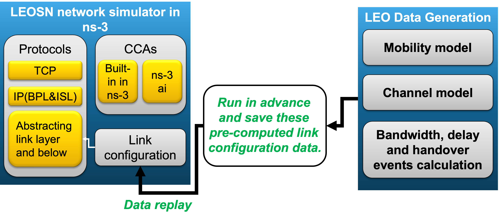

CREO+ simulation testbed
======
The simulation platform of CREO+ is divided into two decoupled modules: 1) **LEOSN data generation** and 2) **LEOSN network simulation** in ns-3. By decoupling data generation from network simulation, the platform avoids repeatedly generating online in ns-3 and computing required data during each run in advance, thereby improving execution speed and efficiency while enhancing overall flexibility.

The LEOSN data generation module is in `./LEOSN Data Generation`, and the LEOSN network simulation module is in `./LEOSN Network Simulation`. Our testbed framework are shown below.

